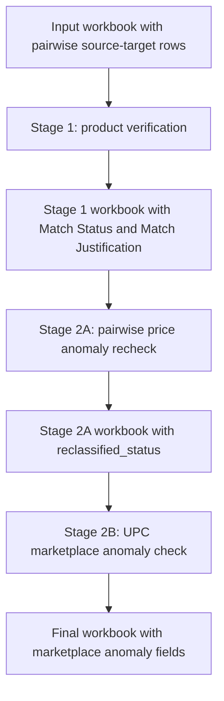

# Full Verification Agent Architecture

## Purpose

The full verification agent is a workbook-based product matching verification pipeline. It runs first-pass product match verification, then performs a second-pass price anomaly verification on rows that were originally classified as exact matches.

The production goal is to preserve the original workbook data, add a small set of verification columns, and run the complete verification flow from one wrapper command.

The current implementation is scripts-only. UI integration is intentionally separate.

## Entry Point

The single production trigger is:

```powershell
powershell -NoProfile -ExecutionPolicy Bypass -File scripts\run_full_verification_flow.ps1 `
  -InputWorkbook <input.xlsx> `
  -BatchSize 100
```

For a limited test run:

```powershell
powershell -NoProfile -ExecutionPolicy Bypass -File scripts\run_full_verification_flow.ps1 `
  -RowLimit 100 `
  -BatchSize 100
```

If `InputWorkbook` is omitted, the wrapper uses:

```text
loreal_wmt_attributes\loreal_wmt_attributes\lorealpi_product_verification_input.xlsx
```

## High-Level Flow



The wrapper runs all stages in sequence. The user does not need to manually start Stage 2A or Stage 2B.

## Output Columns

The pipeline preserves all original input columns and appends or updates these verification-managed columns:

| Column | Owner | Meaning |
| --- | --- | --- |
| `Match Status` | Stage 1 | First-pass product match classification: Exact, Equivalent, or Not a Match. |
| `Match Justification` | Stage 1 | Concise reason for non-Exact Stage 1 classifications. Exact rows usually have blank justification. |
| `reclassified_status` | Stage 2A | Filled as `Equivalent` only when an original Stage 1 Exact row has comparable pair prices, price divergence beyond +/-30%, and the Agent confirms the pair is still equivalent. |
| `marketplace_having_anomaly` | Stage 2B | Marketplace name identified as having the anomalous price for any Equivalent row from Stage 1 or Stage 2A. Blank when no marketplace can be identified or the row is not eligible. |
| `price anomaly justification` | Stage 2B | Short reason for the marketplace anomaly decision, or a script-generated insufficient-data explanation. |

## Stage 1: Product Verification

### Responsibility

Stage 1 verifies whether each pairwise source-target row represents the same product, an equivalent product, or not a match.

### Scripts

| Script | Responsibility |
| --- | --- |
| Stage 1 batch preparation | Reads the input workbook, builds compact batch payloads, and writes Agent instructions. |
| Stage 1 Agent runner | Calls the local Agent CLI, caches raw responses, parses results, and merges Stage 1 output. |
| Stage 1 response parser | Validates Agent JSON and converts compact status codes to normalized labels. |
| Stage 1 workbook merger | Appends or updates `Match Status` and `Match Justification`. |
| `product-verification\SKILL.md` | First-pass product verification rules. |

### Agent Input Contract

The Agent receives compact JSON rows with only the fields needed for product equivalence reasoning. Each row includes `row_idx`, `excel_row`, source attributes, target attributes, identifiers, URLs, titles, brand, descriptions, and other available product evidence.

### Agent Output Contract

The Agent must return compact JSON:

```json
[[row_idx,status_code,justification],...]
```

Allowed status codes:

| Code | Normalized status |
| --- | --- |
| `E` | `Exact` |
| `Q` | `Equivalent` |
| `N` | `Not a Match` |

### Guardrails

- The Agent must include every expected `row_idx` exactly once.
- The Agent must not invent rows outside the batch.
- Exact rows use blank justification.
- Equivalent and Not a Match rows require concise justification.
- The parser rejects malformed JSON, missing rows, duplicate rows, and invalid status codes.

## Stage 2A: Pairwise Price Anomaly Reclassification

### Responsibility

Stage 2A reviews only Stage 1 Exact rows. Its job is to recheck cases where a pair was originally marked Exact and pairwise prices diverge by more than +/-30%. Price divergence alone does not automatically create an equivalent match. The Agent must re-evaluate the product evidence and decide whether the divergence is still an equivalent-match price anomaly or whether it indicates a mismatch, variant, size, pack, or data issue.

Stage 2A does not perform UPC marketplace group analysis. It only works on the pair in the row.

### Scripts

| Script | Responsibility |
| --- | --- |
| `scripts\prepare_price_pair_batches.py` | Selects only Stage 1 Exact rows and writes compact Stage 2A prompts. |
| `scripts\parse_price_pair_response.py` | Parses compact row-index output from the Agent. |
| `scripts\merge_price_pair_results.py` | Writes `reclassified_status = Equivalent` only for returned row indexes. |
| Stage 2A price anomaly skill | Stage 2A pairwise price anomaly rules. |

### Hard Gate 1: Exact Rows Only

Stage 2A processes a row only when Stage 1 `Match Status` is exactly `Exact`, case-insensitively.

Rows with `Equivalent`, `Not a Match`, blank, missing, pending, uncertain, failed, or any non-Exact value are not sent to the Agent for Stage 2A price review.

This gate is enforced by script before prompt generation.

### Hard Gate 2: Pairwise Prices Must Be Comparable

For each Exact row, the Agent must first check whether both pair prices are present and comparable.

A usable pair price must be:

- Present on both source and target sides.
- Numeric.
- Greater than zero.
- A final selling price rather than a rating, discount, coupon, placeholder, range, membership price, subscription price, shipping fee, or malformed value.
- Comparable on currency and unit basis.

If either side lacks a usable comparable price, Stage 2A leaves `reclassified_status` blank.

### Price Divergence Logic

For comparable pair prices:

1. Use source price as the baseline.
2. Compute the acceptable range as:
   - Lower bound: `source_price * 0.70`
   - Upper bound: `source_price * 1.30`
3. Flag the pair only when target price is outside that range.

### Equivalence Recheck

When price diverges, the Agent rechecks whether the products are still equivalent using product evidence, not price alone.

The recheck considers:

- Brand.
- Product title.
- Product line.
- UPC or identifiers.
- Pack size, count, weight, volume, and bundle structure.
- Variant, shade, scent, flavor, formulation, or model.
- Seller and marketplace context.
- URL, images, descriptions, ingredients, and other available row evidence.

If the pair is equivalent after recheck, Stage 2A returns the `row_idx`. If not, it returns nothing for that row.

### Agent Input Contract

Stage 2A sends only compact row fields needed for pairwise price and equivalence reasoning:

- `ri`: stable row index.
- `er`: Excel row.
- Source UPC and target UPC.
- Source and target marketplace.
- Source and target IDs.
- Source and target URLs.
- Brand.
- Title.
- Category.
- Price.
- Currency.
- Seller.
- Relevant descriptions and ingredients, truncated to concise lengths.

### Agent Output Contract

The Agent must return only row indexes that should be reclassified:

```json
[row_idx,...]
```

`[]` means no Stage 2A reclassifications.

### Stage 2A Output Logic

The merge script:

- Ensures `reclassified_status` exists.
- Clears `reclassified_status` for all non-returned rows.
- Writes `Equivalent` only for returned row indexes.

## Stage 2B: UPC Marketplace Price Anomaly Identification

### Responsibility

Stage 2B runs after Stage 2A. It identifies which marketplace has the anomalous price for every row that is Equivalent after Stage 2A, including rows marked `Equivalent` by Stage 1 and rows reclassified to `Equivalent` by Stage 2A.

Stage 2B is not responsible for deciding whether the original pair is equivalent. That decision already happened in Stage 1 or Stage 2A.

### Scripts

| Script | Responsibility |
| --- | --- |
| `scripts\prepare_marketplace_outlier_batches.py` | Selects all Equivalent rows from Stage 1 and Stage 2A, groups the full workbook by source and target UPC, builds marketplace price observations, and filters to UPC groups with more than 2 marketplaces with usable price data. |
| `scripts\parse_marketplace_outlier_response.py` | Parses compact marketplace anomaly output from the Agent. |
| `scripts\merge_marketplace_outlier_results.py` | Writes `marketplace_having_anomaly` and `price anomaly justification`. |

### Stage 2B Eligibility Gates

Stage 2B starts from rows where either condition is true:

```text
Match Status == Equivalent
```

```text
reclassified_status == Equivalent
```

Then the script groups full workbook observations by both available pair UPC fields:

```text
Source_UPC and Target_UPC
```

UPC is the only product grouping key, but marketplace observations are built from both source-side and target-side UPC values. Source marketplace prices are grouped under `Source_UPC`; target marketplace prices are grouped under `Target_UPC`. For a candidate row, Stage 2B combines the source UPC group and target UPC group when both are present.

The script then requires:

```text
more than 2 distinct marketplaces with usable price data
```

If the combined UPC group has 2 or fewer marketplaces with usable price data:

- The Agent is not called.
- `marketplace_having_anomaly` remains blank.
- `price anomaly justification` is filled with an insufficient-data reason.

This prevents unnecessary Agent review when the marketplace distribution is too thin to support a reliable outlier decision.

### Marketplace Price Observation Logic

For every row in the workbook, the Stage 2B preparation script extracts usable source and target prices.

Each price observation contains:

- Marketplace name.
- Listing ID or URL fallback.
- Numeric price.
- Currency.
- Source workbook row index.

The script de-duplicates observations by marketplace, listing, price, and currency.

Marketplace is inferred from explicit marketplace/platform/retailer columns when available, then from URL patterns, then from fallback logic.

### Agent Input Contract

The Agent receives only eligible candidate rows. Each candidate contains:

- Candidate row index.
- UPC.
- Source marketplace and price.
- Target marketplace and price.
- The full source/target UPC-level marketplace price group prepared by script.

The Agent does not discover the UPC group itself. The script prepares the group deterministically.

### Agent Output Contract

The Agent must return compact JSON:

```json
[[row_idx,marketplace,reason],...]
```

Rules:

- Include every expected row index exactly once.
- Use `marketplace` for the marketplace with the anomalous price.
- Use an empty string for `marketplace` if no single marketplace can be identified.
- Keep `reason` concise.

### Stage 2B Output Logic

The merge script:

- Ensures `marketplace_having_anomaly` exists.
- Ensures `price anomaly justification` exists.
- Clears those two columns before writing current Stage 2B results.
- Writes the marketplace name and reason for Stage 2B decisions.

## Batch and Cache Architecture

Every full run gets a timestamped run folder:

```text
outputs\full_verification_runs\full_run_YYYYMMDD_HHMMSS
```

Each stage has its own subfolder:

```text
stage1_product
stage2a_pair
stage2b_marketplace
final
```

Each Agent-backed stage stores:

| Folder or file | Purpose |
| --- | --- |
| `manifest.json` | Stage metadata, input paths, output paths, batch list, expected row indexes, and summary counts. |
| `instructions\instruction_###.md` | Exact prompt sent to the Agent for the batch. |
| `payloads\batch_###.json` | Compact row payload. |
| `raw_responses\raw_###.txt` | Raw Agent response. |
| `results\result_###.json` | Parsed and validated batch result. |
| `final\*.xlsx` | Stage-specific output workbook when applicable. |
| `*.summary.json` | Merge summary with counts and missing batches. |

### Cache Behavior

The wrapper reuses cached batch results unless `-Force` is passed.

For each batch:

1. If parsed `result_###.json` exists and `-Force` is not set, skip the Agent call.
2. Else if raw response exists and `-Force` is not set, parse the cached raw response.
3. Else call the Agent CLI, save raw output, parse it, then merge.

This makes the pipeline resumable and avoids duplicate batch execution.

## Batch Efficiency Strategy

The pipeline keeps each stage focused in several ways:

- Uses `row_idx` as the stable key across every stage.
- Sends only selected rows to each stage.
- Stage 2A sends only Stage 1 Exact rows.
- Stage 2B sends all Equivalent rows from Stage 1 and Stage 2A.
- Stage 2B calls the Agent only when the combined source/target UPC group has more than 2 marketplaces with usable price data.
- Script performs deterministic grouping, price parsing, marketplace counting, and workbook merging.
- The Agent receives compact JSON payloads instead of full workbook rows.
- The Agent returns compact JSON instead of verbose prose.
- Stage 2A returns only row indexes.
- Stage 2B returns only row index, marketplace, and reason.
- Raw and parsed outputs are cached per batch.

## Data Integrity Rules

The pipeline preserves all original input columns and rows.

It writes only the verification-managed columns listed above.

It does not overwrite the original product attributes, source attributes, target attributes, prices, URLs, identifiers, or UPC fields.

The output workbook remains row-aligned to the input workbook. `row_idx` is zero-based relative to the workbook data rows, so:

```text
excel_row = row_idx + 2
```

## Error Handling and Validation

The parsers reject:

- Missing raw response files.
- Invalid JSON.
- JSON that is not an array.
- Duplicate row indexes inside a batch.
- Row indexes outside the expected batch.
- Missing expected row indexes for stages where every row must be returned.
- Unsupported status codes in Stage 1.

The merge scripts reject missing batch results unless `-AllowPartial` is passed.

The wrapper runs with:

```powershell
$ErrorActionPreference = "Stop"
```

Any failed Python command, parser, merge, or Agent call stops the full run.

## Operational Parameters

| Parameter | Default | Purpose |
| --- | --- | --- |
| `InputWorkbook` | Loreal default workbook | Workbook to process. |
| `OutputRoot` | `outputs\full_verification_runs` | Root folder for timestamped run outputs. |
| `BatchSize` | `100` | Rows per Agent batch. |
| `RowStart` | `0` | Zero-based data-row index to start from. |
| `RowLimit` | unset | Optional cap for testing. |
| `Model` | configured default | Agent model identifier passed to the local Agent CLI. |
| `Effort` | `medium` | Agent reasoning effort level. |
| Agent executable parameter | configured default | Local Agent CLI executable path. |
| `PythonExe` | `python` | Python executable. |
| `Force` | false | Re-run the Agent even when cache exists. |
| `AllowPartial` | false | Permit merge with missing batch results. |

## Production Runbook

1. Confirm the input workbook contains pairwise source-target rows.
2. Confirm the workbook includes the source and target product fields expected by Stage 1.
3. Confirm source and target UPC fields are populated, because Stage 2B uses UPCs as the marketplace grouping key.
4. Confirm the local Agent CLI is authenticated and callable.
5. Run `scripts\run_full_verification_flow.ps1`.
6. Monitor console output for each stage.
7. Review `run_summary.json` after completion.
8. Review each stage `*.summary.json` for row counts and missing batches.
9. Use the final workbook under the run folder `final` directory.

## Expected Successful Run Output

A successful run writes:

```text
outputs\full_verification_runs\full_run_YYYYMMDD_HHMMSS\run_summary.json
outputs\full_verification_runs\full_run_YYYYMMDD_HHMMSS\final\<input_stem>_verified_price_anomaly_output.xlsx
outputs\full_verification_runs\full_run_YYYYMMDD_HHMMSS\final\<input_stem>_verified_price_anomaly_output.summary.json
```

The final workbook contains all original rows and the verification-managed output columns.

## Current 100-Row Validation Result

The latest tested 100-row Loreal run used:

```text
Agent model: Sonnet 4.6
Effort: medium
Batch size: 100
Row limit: 100
```

Observed result:

| Stage | Result |
| --- | --- |
| Stage 1 | 100 rows processed: 99 Exact, 1 Equivalent. |
| Stage 2A | 99 Exact rows reviewed, 0 rows reclassified. |
| Stage 2B | Triggered by the wrapper, but had 0 candidate rows in the original validation because no rows were Equivalent after Stage 1 or Stage 2A. |

The Stage 2B no-candidate outcome is expected for that sample only when no rows are Equivalent after Stage 1 or Stage 2A. It confirms that the one-wrapper orchestration works and that the Stage 2B gate avoids unnecessary Agent calls when there are no equivalent-match anomaly candidates.

## Ownership Split Between Script and Agent

The production design intentionally keeps deterministic operations in scripts and judgment-heavy equivalence checks in the Agent.

| Component | Script-owned | Agent-owned |
| --- | --- | --- |
| Stage 1 | Batching, cache, merge, output validation | Product match classification |
| Stage 2A | Exact-row filtering, payload compaction, merge | Pairwise price comparability, +/-30% anomaly reasoning, equivalence recheck |
| Stage 2B | Source/target UPC grouping, price parsing, marketplace count gate, merge | Marketplace anomaly identification from prepared UPC price group |

This split improves reproducibility and keeps workbook writes deterministic.

## Known Boundaries

- Stage 2A only considers rows originally marked Exact.
- Stage 2A does not do marketplace-level UPC grouping.
- Stage 2B considers rows Stage 1 marked Equivalent and rows Stage 2A reclassified to Equivalent.
- Stage 2B requires more than 2 marketplaces with usable price data.
- Stage 2B does not call the Agent for insufficient marketplace coverage.
- The current orchestration is script-based; UI integration is not part of this flow yet.
