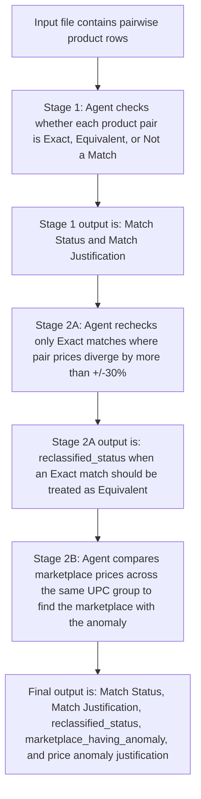

# Verification Agent Overview

## Purpose

The Verification Agent reviews product matching results and adds a second layer of price-based checking. It is designed to help the team identify cases where two products were initially marked as an exact match, but price behavior suggests that the match may need a closer review.

This is especially important because some marketplaces do not clearly show pack count, unit count, or bundle quantity in the product title. A large price difference may be the first signal that one marketplace listing is actually a multi-pack, bundle, different size, or differently structured offer.

## Overall Flow

## Stage 1: Product Match Verification

In the first stage, the Agent reviews each product pair and decides whether the two listings represent the same product.

The Agent checks:

- Product title.
- Brand.
- UPC and product identifiers.
- Pack size, count, weight, volume, or bundle structure.
- Variant details such as shade, scent, flavor, formulation, or model.
- Marketplace and seller context.
- Product descriptions and available supporting details.

Stage 1 classifies each pair as:

| Status | Meaning |
| --- | --- |
| `Exact` | The listings appear to be the same product and same selling unit. |
| `Equivalent` | The listings represent effectively the same product, but there is a meaningful difference such as pack count, bundle structure, size, or listing format. |
| `Not a Match` | The listings appear to be different products. |

Stage 1 output is:

- `Match Status`
- `Match Justification`

## Stage 2A: Pairwise Price Anomaly Recheck

Stage 2A only reviews rows that Stage 1 marked as `Exact`.

The Agent does not recheck every row. It first looks for Exact rows where both marketplace prices are available and comparable.

Then it checks whether the pair prices diverge by more than +/-30%.

If prices do not diverge by more than +/-30%, the Agent leaves the row unchanged.

If prices do diverge by more than +/-30%, the Agent rechecks the product evidence. The Agent does not automatically mark the row as Equivalent just because there is a price difference.

The Agent asks:

- Are these still the same product?
- Is one listing possibly a multi-pack?
- Is one listing possibly a bundle?
- Is there a count, size, or quantity difference?
- Is the price approximately a multiple of the other price?
- Could the price difference be explained by missing pack/count information?

Approximate multiples are important. For example, if one marketplace price is close to 2x, 3x, or 4x another marketplace price, that may suggest a multi-pack or bundle even when the title does not clearly say so.

This matters because some marketplaces do not expose pack count or unit count clearly in the title. The product may look like an exact match from text alone, but price can reveal that the marketplace listing is actually for a different selling quantity.

Stage 2A output is:

- `reclassified_status`

This column is filled only when the Agent rechecks a price-divergent Exact row and determines that it should be treated as `Equivalent`.

## Stage 2B: Marketplace Price Anomaly Identification

Stage 2B runs only for rows that Stage 2A and Stage 1 classified as `Equivalent`.

At this stage, the Agent compares prices across marketplaces for the same UPC group. The goal is to identify which marketplace appears to have the unusual price.

The Agent checks:

- Prices across the available marketplaces for the same UPC.
- Whether most marketplaces share a similar price range.
- Whether one marketplace is far away from the common range.
- Whether the unusual marketplace price may represent a multi-pack, bundle, or different selling quantity.

Example:

If five marketplaces sell a product around `$15-$20`, but one marketplace lists it at `$80`, the `$80` listing is likely the marketplace anomaly. That listing may still be an equivalent product, but it may represent a different pack count or offer structure.

Stage 2B output is:

- `marketplace_having_anomaly`
- `price anomaly justification`

## What The Agent Is Checking Overall

The Agent is checking whether product matching decisions remain reliable when price evidence is considered.

The main checks are:

1. Does the product pair look like an Exact, Equivalent, or Not a Match?
2. If the pair is Exact, are both prices available and comparable?
3. If both prices are comparable, do they differ by more than +/-30%?
4. If prices differ by more than +/-30%, does product evidence still support the match?
5. If the pair should be treated as Equivalent, which marketplace appears to have the unusual price?
6. Could the unusual price be caused by pack count, bundle quantity, size, or missing marketplace title information?

## Why This Second Check Is Needed

Text matching alone can miss selling-unit differences.

Two listings can look identical because:

- The title does not mention pack count.
- The marketplace hides quantity details lower in the page.
- The listing uses vague wording such as "set", "bundle", or "value pack".
- The same UPC appears across multiple marketplace rows, but the marketplace offer structure differs.

Price is a useful signal in these cases. A large divergence or approximate price multiple can indicate that the product is not the same selling unit, even if the titles look similar.

## Final Output Columns

The final file keeps the original data and adds these review columns:

| Column | Meaning |
| --- | --- |
| `Match Status` | Stage 1 match decision. |
| `Match Justification` | Reason for the Stage 1 decision when needed. |
| `reclassified_status` | Filled when Stage 2A changes an Exact row into an Equivalent price-anomaly case. |
| `marketplace_having_anomaly` | Marketplace where the unusual price appears. |
| `price anomaly justification` | Short explanation of why that marketplace was identified. |

## Simple Interpretation

If `reclassified_status` is blank, the Agent did not find a price-anomaly reason to change the original Exact decision.

If `reclassified_status = Equivalent`, the Agent found that the row was originally Exact, had meaningful price divergence, and should be treated as an equivalent-match case after rechecking the product evidence.

If `marketplace_having_anomaly` is filled, that marketplace is the likely source of the unusual price behavior for that UPC group.

